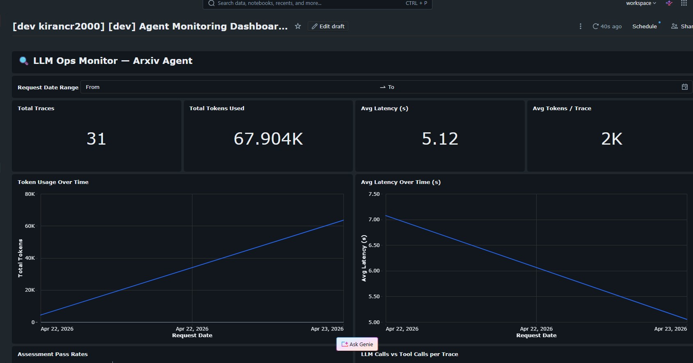

<h1 align="center">
  📰 LLMOps Course on Databricks — ArXiv Curator Agent
</h1>

<p align="center">
  <strong>A comprehensive LLMOps course project demonstrating LLMOps best practices on Databricks</strong>
</p>

---

## 📋 Table of Contents

- [Project Overview](#-project-overview)
- [Key Features](#-key-features)
- [Architecture](#-architecture)
- [Project Structure](#-project-structure)
- [Prerequisites](#-prerequisites)
- [Setup Instructions](#-setup-instructions)
- [Configuration](#-configuration)
- [Running the Project](#-running-the-project)
- [Available Skills/Commands](#-available-skillscommands)
- [Notebooks Guide](#-notebooks-guide)
- [Development Workflow](#-development-workflow)
- [Deployment](#-deployment)
- [Monitoring & Evaluation](#-monitoring--evaluation)
- [Dependencies](#-dependencies)
- [Troubleshooting](#-troubleshooting)

---

## 🎯 Project Overview

**ArXiv Curator Agent** is a comprehensive LLMOps course project built on Databricks that demonstrates:

- **Foundation Models & LLM Integration**: Working with Databricks' provisioned throughput endpoints
- **Retrieval-Augmented Generation (RAG)**: Vector search, embeddings, and semantic retrieval
- **Multi-Agent Systems**: Custom functions, tools, and Model Context Protocol (MCP) integration
- **Session Memory & Persistence**: Lakebase-backed memory management
- **Tracing & Observability**: MLflow tracing and evaluation
- **Model Deployment**: Publishing agents as API endpoints
- **Authentication & Security**: Service Principal Name (SPN) authentication
- **Performance Monitoring**: Custom dashboards and evaluation metrics

The agent helps users create engaging LinkedIn posts about ArXiv research papers by:
1. Searching for relevant papers using vector search
2. Querying the Genie space for additional context
3. Generating professional, accessible LinkedIn content

---

## ✨ Key Features

| Feature | Description |
|---------|-------------|
| **LLM Integration** | Provisioned throughput endpoints (Llama 4 Maverick, Meta Llama 3.1 70B) |
| **Vector Search** | Databricks vector search for semantic paper retrieval |
| **MCP Tools** | Model Context Protocol integration for extensible tool ecosystem |
| **Session Memory** | Persistent conversation memory using Lakebase |
| **Tracing** | End-to-end MLflow tracing for observability |
| **Evaluation** | Quality metrics (word count, tone, engagement hooks) |
| **Authentication** | Service Principal Name (SPN) support for Workspace objects |
| **Monitoring Dashboard** | Real-time performance metrics and quality scores |
| **Asset Bundles** | Infrastructure-as-code deployment with Databricks CLI |
| **Unity Catalog** | Governed data and model management |

---

## 🏗️ Architecture

```
┌─────────────────────────────────────────────────────────────┐
│                    ArXiv Curator Agent                       │
├─────────────────────────────────────────────────────────────┤
│                                                              │
│  ┌──────────────────────────────────────────────────────┐   │
│  │ Agent Layer (ResponsesAgent + MLflow)                │   │
│  │ - LLM Endpoint (Llama 4 Maverick)                    │   │
│  │ - Tool Execution Framework                           │   │
│  │ - Tracing & Observability                            │   │
│  └──────────────────────────────────────────────────────┘   │
│                           ↓                                  │
│  ┌──────────────────────────────────────────────────────┐   │
│  │ Tools Layer (MCP Integration)                        │   │
│  │ - Vector Search (ArXiv papers)                       │   │
│  │ - Genie Space (Research insights)                    │   │
│  │ - Custom Functions                                   │   │
│  │ - Session Memory (Lakebase)                          │   │
│  └──────────────────────────────────────────────────────┘   │
│                           ↓                                  │
│  ┌──────────────────────────────────────────────────────┐   │
│  │ Data Layer                                           │   │
│  │ - Unity Catalog (mlops_dev/mlops_acc)                │   │
│  │ - Vector Search Index                                │   │
│  │ - Trace Logs & Assessments                           │   │
│  │ - Lakebase (Memory Store)                            │   │
│  └──────────────────────────────────────────────────────┘   │
│                           ↓                                  │
│  ┌──────────────────────────────────────────────────────┐   │
│  │ Serving & Deployment                                │   │
│  │ - Model Serving Endpoint                             │   │
│  │ - Databricks CLI (Asset Bundles)                     │   │
│  │ - Monitoring Dashboard                               │   │
│  └──────────────────────────────────────────────────────┘   │
│                                                              │
└─────────────────────────────────────────────────────────────┘
```

---

## 📁 Project Structure

```
llmops-databricks-course-kiran73code/
├── .claude/
│   └── commands/                          # Claude AI slash commands
│       ├── fix-deps                       # Update dependencies
│       ├── run-notebook                   # Deploy and run notebooks
│       └── ship                           # Commit and push changes
│
├── .github/
│   └── workflows/
│       └── ci.yml                         # CI/CD pipeline
│
├── notebooks/                             # Training & exploration
│   ├── 1.x_foundation_models/             # LLM & endpoints
│   │   ├── 1.1_foundation_models_overview.py
│   │   ├── 1.2_provisioned_throughput_deployment.py
│   │   ├── 1.3_arxiv_data_ingestion.py
│   │   └── 1.4_external_models_custom_provider.py
│   │
│   ├── 2.x_context_engineering/           # RAG & chunking
│   │   ├── 2.1_context_engineering_theory.py
│   │   ├── 2.2_pdf_parsing_ai_parse.py
│   │   ├── 2.3_chunking_strategies.py
│   │   └── 2.4_embeddings_vector_search.py
│   │
│   ├── 3.x_agent_tools/                   # Agent tools & MCP
│   │   ├── 3.1_custom_functions_tools.py
│   │   ├── 3.1b_simple_rag.py
│   │   ├── 3.2_mcp_integration.py
│   │   ├── 3.2b_genie.py
│   │   ├── 3.3_session_memory_lakebase.py
│   │   ├── 3.4_spn_authentication.py
│   │   └── 3.5_spn_authentication_in_action.py
│   │
│   ├── 4.x_mlops/                        # MLflow & evaluation
│   │   ├── 4.1_tracing_implementation.py
│   │   ├── 4.2_custom_agent.py
│   │   ├── 4.3_evaluation_theory.py
│   │   └── 4.4_mlflow_log_register.py
│   │
│   ├── 5.x_deployment/                   # Endpoint deployment
│   │   ├── 5.1_endpoint_deployment.py
│   │   └── 5.2_spn_permissions.py
│   │
│   └── 6.x_monitoring/
│       └── 6.1_propagate_traces.py
│
├── resources/                             # Databricks Asset Bundle (DAB)
│   ├── arxiv_data_ingestion_job.yml       # Data ingestion job
│   ├── process_data.yml                   # Data processing
│   ├── register_deploy_agent.yml          # Agent registration & deployment
│   ├── update_traces_aggregated.yml       # Trace aggregation & evaluation
│   │
│   ├── dashboard/
│   │   ├── agent_monitoring_dashboard.lvdash.json
│   │   └── agent_monitoring_dashboard.yml
│   │
│   └── deployment_scripts/
│       ├── deploy_agent.py                # Agent deployment script
│       ├── log_register_agent.py          # MLflow logging
│       ├── process_data.py                # Data processing
│       └── update_traces_aggregated.py    # Trace evaluation
│
├── src/arxiv_curator/                    # Main package
│   ├── __init__.py
│   ├── agent.py                          # ArxivAgent class (ResponsesAgent)
│   ├── config.py                         # ProjectConfig (YAML-based)
│   ├── data_processor.py                 # Data processing utilities
│   ├── evaluation.py                     # Quality evaluation functions
│   ├── mcp.py                            # MCP tool creation
│   ├── memory.py                         # LakebaseMemory class
│   ├── vector_search.py                  # Vector search utilities
│   │
│   └── utils/
│       └── common.py                     # Common utilities
│
├── tests/
│   ├── __init__.py
│   └── test_basic.py                     # Basic tests
│
├── arxiv_agent.py                        # Model serving entry point
├── databricks.yml                        # Asset Bundle configuration
├── pyproject.toml                        # Python project config
├── project_config.yml                    # Project settings (dev/acc/prd)
├── version.txt                           # Version number
├── CLAUDE.md                             # Claude guidelines
├── eval_inputs.txt                       # Evaluation inputs
└── README.md                             # This file
```

---

## 📋 Prerequisites

### System Requirements
- **Python**: 3.12 (matches Databricks Serverless Environment 4)
- **OS**: Linux, macOS, or Windows (with WSL)
- **RAM**: 4GB minimum for local development
- **Disk**: 2GB for dependencies

### Required Tools
- **uv**: Python package manager (https://docs.astral.sh/uv/getting-started/installation/)
- **Databricks CLI**: v0.200+ (for Asset Bundle deployment)
- **Git**: For version control

### Databricks Requirements
- **Workspace**: Access to Databricks workspace
- **Unity Catalog**: Enabled with read/write permissions
- **Endpoints**: Model serving endpoints configured
- **Warehouse**: SQL warehouse for queries
- **Vector Search**: Configured for semantic search

---

## 🚀 Setup Instructions

### Step 1: Clone Repository

```bash
git clone <repository-url>
cd llmops-databricks-course-kiran73code
```

### Step 2: Install UV

```bash
# macOS
brew install uv

# Linux (using curl)
curl -LsSf https://astral.sh/uv/install.sh | sh

# Windows (using PowerShell)
powershell -c "irm https://astral.sh/uv/install.ps1 | iex"
```

### Step 3: Create Virtual Environment & Install Dependencies

```bash
# Create venv and sync dependencies
uv sync --extra dev

# Verify Python version
uv run python --version
# Output should be: Python 3.12.x
```

### Step 4: Configure Databricks CLI

```bash
# Authenticate with Databricks
databricks auth login --host https://dbc-xxxx.cloud.databricks.com

# Verify configuration
databricks workspace list
```

### Step 5: Verify Environment

```bash
# Run tests
uv run pytest

# Run linting
uv run pre-commit run --all-files
```

---

## ⚙️ Configuration

### Environment Configuration (project_config.yml)

The project supports three environments: **dev**, **acc**, and **prd**.

**Development Environment Example:**
```yaml
dev:
  catalog: mlops_dev                                    # Unity Catalog
  schema: kirancr2                                      # Schema name
  volume: arxiv_files                                   # Volume for files
  llm_endpoint: databricks-llama-4-maverick             # LLM endpoint
  embedding_endpoint: databricks-gte-large-en          # Embedding model
  warehouse_id: 96e26e80fcd91931                       # SQL warehouse
  vector_search_endpoint: llmops_course_vector_search   # Vector search
  genie_space_id: 01f138118f441190b7c32ead17657df6    # Genie space
  usage_policy_id: e69229b5-97d1-4c81-b755-95b8894d8f4a
  experiment_name: /Shared/arxiv-curator-agent-dev
  lakebase_project_id: arxiv-agent-lakebase-kiran
```

### Load Configuration in Code

```python
from arxiv_curator.config import ProjectConfig

# Load from YAML
config = ProjectConfig.from_yaml("project_config.yml", env="dev")

# Access properties
print(config.catalog)                # mlops_dev
print(config.full_schema_name)       # mlops_dev.kirancr2
print(config.full_volume_path)       # mlops_dev.kirancr2.arxiv_files
```

### Asset Bundle Configuration (databricks.yml)

```yaml
bundle:
  name: llmops-databricks-course-kiran73code
  include:
    - resources/*.yml

targets:
  dev:
    mode: development
    workspace:
      host: https://dbc-xxxx.cloud.databricks.com/
      root_path: /Workspace/Users/.../.bundle/${bundle.name}/${bundle.target}
    variables:
      schedule_pause_status: "PAUSED"

  prd:
    workspace:
      host: https://dbc-xxxx.cloud.databricks.com/
    variables:
      schedule_pause_status: "UNPAUSED"
```

---

## 🏃 Running the Project

### Running Locally

```bash
# Activate environment
uv run python --version

# Run specific notebook
uv run python notebooks/1.1_foundation_models_overview.py

# Test the agent
uv run python -c "from arxiv_curator.agent import ArxivAgent; print('Agent imported')"
```

### Running on Databricks

**Using Databricks CLI Asset Bundles:**

```bash
# Deploy to dev environment
databricks bundle deploy -t dev

# Run a specific job
databricks bundle run -t dev update-and-evaluate-traces

# View logs
databricks bundle logs -t dev -j update-and-evaluate-traces
```

---

## 🛠️ Available Skills/Commands

> These are Claude AI slash commands defined in `.claude/commands/`

### `/fix-deps`

Automatically updates `pyproject.toml` to the latest compatible versions from PyPI.

```bash
# Usage
/fix-deps

# What it does:
# 1. Queries PyPI for latest versions
# 2. Updates pinned dependencies
# 3. Validates environment resolves
```

### `/run-notebook <path>`

Deploys the project and runs a notebook as a Databricks job.

```bash
# Usage
/run-notebook notebooks/6.1_propagate_traces.py

# What it does:
# 1. Creates job resource (e.g., propagate_traces_job)
# 2. Creates resources/<key>.yml with job config
# 3. Runs: databricks bundle deploy
# 4. Runs: databricks bundle run <key>
# 5. Streams job output
```

### `/ship`

Commits all changes with structured messaging and pushes to remote.

```bash
# Usage
/ship

# Features:
# - Formats commit message
# - Validates changes
# - Blocks pushing to main branch
```

---

## 📓 Notebooks Guide

### Module 1: Foundation Models (1.1 - 1.4)

| Notebook | Topics | Outputs |
|----------|--------|---------|
| **1.1** | LLM overview, endpoint types, provisioned throughput | - |
| **1.2** | Creating provisioned throughput endpoints | Endpoint creation script |
| **1.3** | ArXiv data ingestion, preprocessing | Paper data in UC |
| **1.4** | Custom provider for external models | Custom endpoint config |

### Module 2: Context Engineering (2.1 - 2.4)

| Notebook | Topics | Outputs |
|----------|--------|---------|
| **2.1** | RAG theory, chunking, embeddings | Theory notes |
| **2.2** | PDF parsing using AI Parse | Parsed documents |
| **2.3** | Chunking strategies (recursive, sliding window) | Chunked data |
| **2.4** | Embeddings & vector search setup | Vector index |

### Module 3: Agent Tools & MCP (3.1 - 3.6)

| Notebook | Topics | Outputs |
|----------|--------|---------|
| **3.1** | Custom functions & tool specification | Tool definitions |
| **3.1b** | Simple RAG implementation | Basic RAG pipeline |
| **3.2** | Model Context Protocol integration | MCP tools |
| **3.2b** | Genie space integration | Genie queries |
| **3.3** | Session memory with Lakebase | Memory persistence |
| **3.4** | Service Principal authentication | SPN config |
| **3.5** | Using SPN authentication | Authenticated calls |
| **3.6** | Unity Catalog functions | UC function deployment |

### Module 4: MLOps (4.1 - 4.4)

| Notebook | Topics | Outputs |
|----------|--------|---------|
| **4.1** | MLflow tracing setup | Traced spans |
| **4.2** | Custom agent with tracing | Full agent with traces |
| **4.3** | Evaluation metrics theory | Evaluation framework |
| **4.4** | Logging & model registration | Registered model |

### Module 5: Deployment (5.1 - 5.2)

| Notebook | Topics | Outputs |
|----------|--------|---------|
| **5.1** | Endpoint deployment & serving | Live endpoint |
| **5.2** | SPN permissions for endpoints | Secured endpoint |

### Module 6: Monitoring (6.1)

| Notebook | Topics | Outputs |
|----------|--------|---------|
| **6.1** | Trace propagation & aggregation | Dashboard data |

---

## 👨‍💻 Development Workflow

### Adding New Dependencies

```bash
# Update pyproject.toml manually or use /fix-deps
uv sync --extra dev

# Verify
uv run pip list | grep <package-name>
```

### Dependency Rules

**Regular dependencies** (production):
- Pin to exact version: `"pydantic==2.11.7"`

**Optional/Dev dependencies**:
- Use ranges: `"pytest>=8.3.4,<9"`

**Must Always Be Optional:**
- `databricks-connect` → `dev` extra
- `ipykernel` → `dev` extra
- `pytest`, `pre-commit` → `ci` extra

### Code Quality

```bash
# Run all pre-commit checks
uv run pre-commit run --all-files

# Format code
uv run ruff format src/ tests/

# Lint
uv run ruff check src/ tests/
```

### Testing

```bash
# Run all tests
uv run pytest

# Run specific test
uv run pytest tests/test_basic.py::test_config_loading

# With coverage
uv run pytest --cov=src
```

### Notebook Format

All Python notebooks must use Databricks format:

```python
# Databricks notebook source
"""Module description."""

import sys
# COMMAND ----------

# First cell content
print("Hello")

# COMMAND ----------

# Second cell
result = 42
```

**Rules:**
- First line: `# Databricks notebook source`
- Cell separators: `# COMMAND ----------`
- **Never** use shebang (`#!/usr/bin/env python`)

---

## 🚀 Deployment

### Prerequisites

```bash
# Verify Databricks CLI
databricks version

# Verify workspace access
databricks workspace get-status /
```

### Deploy to Development

```bash
# Full deployment
databricks bundle deploy -t dev --force

# Deploy specific resource
databricks bundle deploy -t dev --select agent-monitoring-dashboard

# Run a job
databricks bundle run -t dev update-and-evaluate-traces
```

### Deploy to Production

```bash
# Staging (acceptance testing)
databricks bundle deploy -t acc --force
databricks bundle run -t acc update-and-evaluate-traces

# Production (after testing)
databricks bundle deploy -t prd --force
```

### CI/CD Pipeline

The project uses GitHub Actions for automated testing and deployment:


**Pipeline Features:**
- Automated testing on push/PR
- Linting and code quality checks
- Asset Bundle validation
- Deployment to dev/acc environments

### Monitor Deployment

```bash
# View recent runs
databricks jobs list-runs --job-id <job-id> | head -10

# Stream job logs
databricks bundle logs -t dev -j arxiv-update-and-evaluate-traces
```

---

## 📊 Monitoring & Evaluation

### MLflow Tracing

All agent calls are automatically traced via MLflow:

```python
@mlflow.trace(span_type=SpanType.AGENT)
def chat_with_agent(messages):
    return agent.invoke(messages)

# View traces in Databricks workspace:
# Experiment → Runs → Traces tab
```

### Quality Evaluation

Three quality metrics are computed:

```python
from arxiv_curator.evaluation import (
    word_count_check,
    polite_tone_guideline,
    hook_in_post_guideline,
)

# Evaluate a response
scores = {
    "word_count": word_count_check(response),
    "tone": polite_tone_guideline(response),
    "engagement": hook_in_post_guideline(response),
}

quality_score = sum(scores.values()) / len(scores) * 100  # 0-100%
```

### Monitoring Dashboard

A Lakebase dashboard aggregates all metrics:

**URL:** `https://dbc-xxxx.cloud.databricks.com/sql/dashboards/01f1377...`



**Metrics Shown:**
- Total traces processed
- Average quality scores
- Latency distribution
- Error rate
- Model serving endpoint usage
- Request date range filtering
- Quality score breakdowns

### Automated Evaluation Job

Runs daily at 7:00 AM (Europe/Amsterdam):

```yaml
Job: arxiv-update-and-evaluate-traces
Schedule: 0 0 7 * * ? (7 AM daily)
Status: PAUSED (in dev)
```

---

## 📦 Dependencies

### Core Dependencies

| Package | Version | Purpose |
|---------|---------|---------|
| `databricks-sdk` | 0.85.0 | Workspace API client |
| `pydantic` | 2.11.7 | Data validation |
| `mlflow` | 3.10.1 | MLOps tracking |
| `openai` | 2.8.0 | LLM API client |
| `databricks-agents` | 1.8.2 | Agent framework |
| `databricks-mcp` | 0.4.0 | MCP tool creation |
| `databricks-vectorsearch` | 0.63 | Vector search client |

### Development Dependencies

| Package | Version | Purpose |
|---------|---------|---------|
| `databricks-connect` | 17.x | Local development |
| `ipykernel` | 6.x | Jupyter kernel |
| `pre-commit` | 4.x | Git hooks |
| `pytest` | 8.x | Testing framework |
| `claudetracing` | 0.2.x | Claude tracing |

### Install Development Environment

```bash
uv sync --extra dev
```

---

## 🐛 Troubleshooting

### Issue: "Python 3.12 not found"

```bash
# Solution 1: Use uv to manage Python
uv python install 3.12

# Solution 2: Check system Python
which python3.12
python3.12 --version
```

### Issue: "databricks-connect" import fails

```bash
# Make sure dev extra is installed
uv sync --extra dev

# Verify
uv run python -c "import databricks.connect; print('OK')"
```

### Issue: "Vector search endpoint not found"

```bash
# List available endpoints
databricks vector-search-endpoints list

# Check configuration
uv run python -c "from arxiv_curator.config import ProjectConfig; cfg = ProjectConfig.from_yaml('project_config.yml'); print(cfg.vector_search_endpoint)"
```

### Issue: "Asset Bundle deploy fails"

```bash
# Validate bundle config
databricks bundle validate -t dev

# Check auth
databricks auth profiles

# Redeploy with force
databricks bundle deploy -t dev --force --no-lock
```

### Issue: "Tests fail with pytest"

```bash
# Run with verbose output
uv run pytest -vv

# Run specific test
uv run pytest tests/test_basic.py -vv

# Show print statements
uv run pytest -s
```

### Issue: "Import errors in notebooks"

```bash
# Rebuild package wheel
uv build

# Redeploy bundle
databricks bundle deploy -t dev --force

# Or run notebook with full path
uv run python notebooks/1.1_foundation_models_overview.py
```

---

## 📝 Key Code Examples

### Creating a Vector Search Index

```python
from arxiv_curator.vector_search import VectorSearchManager

manager = VectorSearchManager(endpoint_name="llmops_course_vector_search_endpoint")

# Create or get index
index = manager.get_or_create_index(
    index_name="arxiv_papers",
    table_name="mlops_dev.kirancr2.arxiv_papers",
)

# Search
results = manager.search(
    query_text="attention mechanisms",
    top_k=5,
)
```

### Using the Agent

```python
from arxiv_curator.agent import ArxivAgent

agent = ArxivAgent(
    llm_endpoint="databricks-llama-4-maverick",
    system_prompt="You are a LinkedIn content expert...",
    catalog="mlops_dev",
    schema="kirancr2",
    genie_space_id="01f138118f441190b7c32ead17657df6",
    lakebase_project_id="arxiv-agent-lakebase-kiran",
)

# Chat with agent
response = agent.invoke(
    messages=[{"role": "user", "content": "Write a post about transformers"}]
)
```

### Session Memory

```python
from arxiv_curator.memory import LakebaseMemory

memory = LakebaseMemory(project_id="arxiv-agent-lakebase-kiran")

# Store a fact
memory.add_memory("key_insight", "Transformers use attention mechanisms")

# Retrieve
fact = memory.get_memory("key_insight")

# Get full context
context = memory.get_context()
```

---

## 📚 Additional Resources

- [Databricks Documentation](https://docs.databricks.com)
- [MLflow Documentation](https://mlflow.org/docs)
- [Model Context Protocol](https://modelcontextprotocol.io)
- [Vector Search Guide](https://docs.databricks.com/en/generative-ai/vector-search.html)
- [Asset Bundles](https://docs.databricks.com/en/dev-tools/bundles)

---

## 📄 License

This project is part of the     [ LLMOps with Databricks course.](https://maven.com/cauchy/llmops-with-databricks)

---
